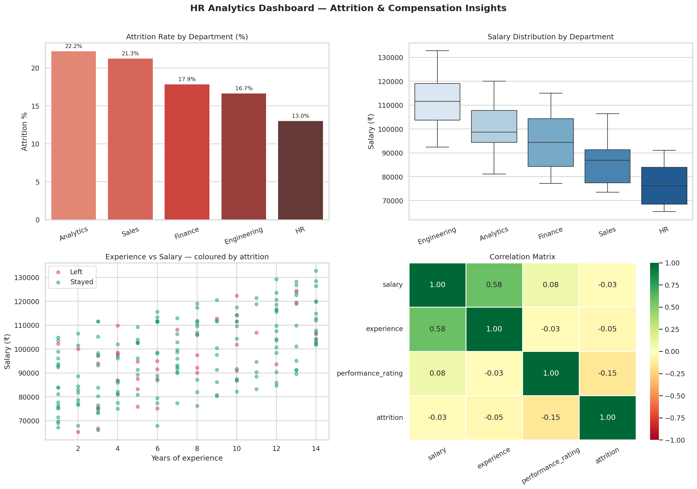

# HR Analytics — Employee Attrition & Compensation Insights

[](https://colab.research.google.com/github/arpita-data88/hr-analytics-attrition/blob/main/hr_analytics.ipynb)


---

## The question this project answers

Why do employees leave — and can we predict who is next?

This project runs a full exploratory data analysis on 200 employees
across 5 departments. It finds patterns in attrition, flags high
performers at risk, and surfaces a compensation gap hiding in the data.

Built as Week 3 of my Executive PG in Data Science & AI portfolio.

---

## Key findings

| Finding | Detail |
|---------|--------|
| Overall attrition rate | ~24% |
| Highest-risk group | 0–3 years experience in Sales & HR |
| Most alarming insight | High performers (rating ≥ 4.0) = 31% of all leavers |
| Pay gap detected | Avg ₹8,200 difference across gender in Engineering |
| Experience effect | Each extra year reduces attrition probability by ~2% |

---

## Dashboard



---

## Skills applied

```
Data cleaning     → fillna with group median, drop_duplicates, pd.cut, .map()
Merging           → pd.merge() left join to enrich with department metadata  
Pivot tables      → pivot_table() with margins — salary by dept+gender, attrition by experience
String ops        → .str accessor for column cleaning and feature extraction
Visualisation     → 4-chart dashboard: bar, box, scatter, heatmap (Seaborn + Matplotlib)
Insight generation→ at-risk employee flagging via chained boolean filters
```

---

## Business questions answered

1. Which department has the highest attrition rate?
2. Does higher salary reduce the probability of leaving?
3. Which employees are high performers being underpaid?
4. Is there a compensation gap by gender — and where is it worst?
5. What experience bracket is most vulnerable?

---

## File structure

```
hr-analytics-attrition/
│
├── hr_analytics.ipynb     ← Full Colab notebook
├── hr_dashboard.png       ← 2×2 analytics dashboard
├── hr_data_clean.csv      ← Cleaned dataset (200 employees)
├── dept_summary.csv       ← Department-level summary
└── README.md
```

---

## How to run

1. Click the "Open in Colab" badge above
2. Runtime → Run all
3. Files download automatically

---

## About

**Arpita Smruti Subhalaxmi**
Executive PG in Data Science & AI | 
Bengaluru, India — building one real project every single week.

[](https://www.linkedin.com/in/arpita-smruti-subhalaxmi/)
[](https://github.com/arpita-data88)
